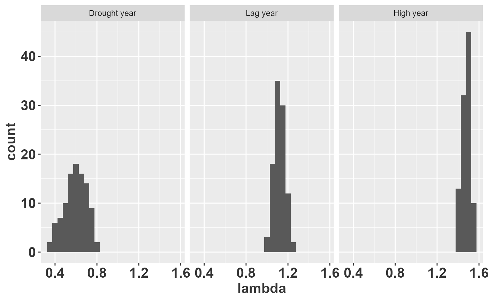

# 06 Matrices of animal populations

Although the companion paper and the other `raretrans` vignettes focus
on perennial plant data sets, the same Bayesian principles apply to
animal populations. Small sample sizes compromise the estimation of
survival and reproduction whenever the analyst believes that matrix
entries should vary by age, sex, or environmental condition. In some
cases there are no data at all for a particular combination of stage and
environment, and the analysis must proceed using expert opinion—what
Bayesians call *prior beliefs*.

Expressing those beliefs as probability distributions (rather than
single point estimates) has two practical advantages. First, it forces
the analyst to be explicit about how confident they are in each
parameter. Second, it provides a principled way to propagate that
uncertainty through derived quantities such as the asymptotic population
growth rate $`\lambda`$, the stable stage distribution, or extinction
risk.

This vignette walks through a published Population Viability Analysis
(PVA) for the endangered Florida Snail Kite and shows, step by step, how
to re-express the original normal-distribution assumptions as Beta
priors. The example does not use the `raretrans` functions directly
because the published information is given as means and standard
deviations rather than as raw transition counts. Nevertheless, the
underlying logic—combining prior beliefs with data through conjugate
Bayesian models—is exactly the same. A final section at the end shows
how to connect this workflow back to `raretrans` when count data are
available.

``` r

library(dplyr)
library(tidyr)
library(purrr)
library(tibble)
library(ggplot2)
library(popbio)
library(huxtable)

# Raymond's theme modifications
rlt_theme <- theme(axis.title.y = element_text(colour="grey20",size=15,face="bold"),
        axis.text.x = element_text(colour="grey20",size=15, face="bold"),
        axis.text.y = element_text(colour="grey20",size=15,face="bold"),  
        axis.title.x = element_text(colour="grey20",size=15,face="bold"))
```

## Snail kites

### Background

The Florida Snail Kite (*Rostrhamus sociabilis plumbeus*) is a wetland
raptor that feeds almost exclusively on apple snails (*Pomacea
paludosa*). Because snails are sensitive to water depth, periodic
drought events in the Everglades create a direct link between
hydrological management and kite demography. Stephen Beissinger (1995)
developed a stage-based PVA to evaluate how the frequency of drought
cycles affects the kite’s long-term viability. This study is a classic
example of how expert opinion fills the gaps left by sparse field data.

### Study design and data sources

Radio-telemetry and nest monitoring provided reasonably reliable
survival and nest-success estimates for “high water” years, but data for
“drought” and “lag” (recovery) years were far scarcer. Beissinger used a
combination of field observations and expert judgement to assign
parameter values for those environments. The model distinguished three
age classes—fledgling, subadult, and adult—because small sample sizes
precluded a finer age structure.

The table below (reproduced from Table 2 of Beissinger (1995))
summarises the vital rates used in the PVA. For each combination of
environmental state and age class, means, standard deviations, and
ranges are given for both nest success and annual survival. Beissinger
sampled these parameters from normal distributions during the stochastic
simulations.

``` r

b1995_table2 <- tribble(
  ~env_state, ~age_class, ~mean_ns, ~sd_ns, ~range_ns, ~prop_nesting, ~attempts, ~mean_s, ~sd_s, ~range_s,
  "", "", "Nesting success", "","", "", "", "Annual survival", "","",
  "Environmental state", "Age Class", "Mean", "SD","Range", "Proportion Nesting", 
  "Nesting attempts per year", "Mean", "SD", "Range",
  "Drought year", "Fledgling", "0.00", "0.00", "0.00-0.00", "0.00", "0.00", "0.50","0.10", "0.30-0.80",
  "", "Subadult", "0.03", "0.10", "0.00-0.25", "0.15", "1.00", "0.60", "0.10", "0.40-0.90",
  "", "Adult", "0.03", "0.10", "0.00-0.25", "0.15", "1.00", "0.60", "0.10", "0.40-0.90",
  "Lag year", "Fledgling", "0.00", "0.00", "0.00-0.00", "0.00", "0.00", "0.85","0.03", "0.75-0.92",
  "", "Subadult", "0.16", "0.10", "0.04-0.33", "0.15", "1.00", "0.90", "0.03", "0.80-0.95",
  "", "Adult",  "0.16", "0.10", "0.04-0.33", "0.80", "1.50", "0.90", "0.03", "0.80-0.95",
  "High year", "Fledgling", "0.00", "0.00", "0.00-0.00", "0.00", "0.00", "0.90","0.03", "0.75-0.92",
  "", "Subadult", "0.30", "0.10", "0.1-0.40", "0.25", "1.00", "0.95", "0.03", "0.85-0.98",
  "", "Adult", "0.30", "0.10", "0.1-0.40", "1.00", "2.20", "0.95", "0.03", "0.85-0.98")

huxtable(b1995_table2) %>% 
  set_colspan(row = 1, col = c(3,8), value = 3) %>% 
  theme_article(header_col = FALSE) %>% 
  set_width(0.9) %>% 
  set_col_width(c(0.15, 0.1, 0.075, 0.075, 0.1, 0.15, 0.15, 0.075, 0.075, 0.1)) %>% 
  set_position("left") %>% 
  set_bottom_border(row = 1, col = everywhere, value = 0) %>% 
  set_bottom_border(row = 2, col = everywhere, value = 1) %>% 
  set_caption("Snail kite vital rates from Beissinger (1995), Table 2.")
```

|  |  |  |  |  |  |  |  |  |  |
|----|----|----|----|----|----|----|----|----|----|
|  |  | Nesting success |  |  |  |  | Annual survival |  |  |
| Environmental state | Age Class | Mean | SD | Range | Proportion Nesting | Nesting attempts per year | Mean | SD | Range |
| Drought year | Fledgling | 0.00 | 0.00 | 0.00-0.00 | 0.00 | 0.00 | 0.50 | 0.10 | 0.30-0.80 |
|  | Subadult | 0.03 | 0.10 | 0.00-0.25 | 0.15 | 1.00 | 0.60 | 0.10 | 0.40-0.90 |
|  | Adult | 0.03 | 0.10 | 0.00-0.25 | 0.15 | 1.00 | 0.60 | 0.10 | 0.40-0.90 |
| Lag year | Fledgling | 0.00 | 0.00 | 0.00-0.00 | 0.00 | 0.00 | 0.85 | 0.03 | 0.75-0.92 |
|  | Subadult | 0.16 | 0.10 | 0.04-0.33 | 0.15 | 1.00 | 0.90 | 0.03 | 0.80-0.95 |
|  | Adult | 0.16 | 0.10 | 0.04-0.33 | 0.80 | 1.50 | 0.90 | 0.03 | 0.80-0.95 |
| High year | Fledgling | 0.00 | 0.00 | 0.00-0.00 | 0.00 | 0.00 | 0.90 | 0.03 | 0.75-0.92 |
|  | Subadult | 0.30 | 0.10 | 0.1-0.40 | 0.25 | 1.00 | 0.95 | 0.03 | 0.85-0.98 |
|  | Adult | 0.30 | 0.10 | 0.1-0.40 | 1.00 | 2.20 | 0.95 | 0.03 | 0.85-0.98 |

Snail kite vital rates from Beissinger (1995), Table 2. {.table
.huxtable quarto-disable-processing="true"
style="width: 90%; margin-left: 0%; margin-right: auto;"}

### Survival values

#### Why a Beta distribution?

In a stage-structured matrix with $`k`$ possible fates (including
death), survival probabilities form a multinomial, and the natural
conjugate prior is a Dirichlet distribution (the approach used by
`raretrans`). In this particular age-structured model, however, an
individual of a given age can only survive to the next age class or
die—exactly two possible outcomes. The Binomial likelihood paired with a
$`\text{Beta}(\alpha, \beta)`$ prior is therefore sufficient.

The Beta distribution is bounded on $`[0, 1]`$, making it appropriate
for probabilities. Its two parameters $`\alpha`$ and $`\beta`$ can be
interpreted as pseudo-counts: $`\alpha`$ “prior survivals” and $`\beta`$
“prior deaths”. Their sum $`\alpha + \beta`$ acts as an *effective
sample size* that controls how concentrated the distribution is around
its mean.

#### Moment matching: from mean and SD to $`\alpha`$ and $`\beta`$

The mean and variance of a $`\text{Beta}(\alpha, \beta)`$ distribution
are:

``` math
\mu = \frac{\alpha}{\alpha + \beta}, \qquad
\sigma^2 = \frac{\alpha \beta}{\left(\alpha + \beta\right)^2\left(\alpha + \beta + 1\right)}
```

Beissinger (1995) reports $`\mu`$ and $`\sigma`$ (Table 2). We can
recover approximate $`\alpha`$ and $`\beta`$ by *moment
matching*—equating the distribution’s theoretical moments to the
observed summary statistics. Defining the auxiliary quantity $`\nu`$:

``` math
\begin{align*}
\nu    &= \frac{\mu\left(1-\mu\right)}{\sigma^2} \\
\alpha &= \nu\,\mu \\
\beta  &= \left(1-\mu\right)\,\nu
\end{align*}
```

This conversion is valid as long as $`\sigma^2 < \mu(1 - \mu)`$, which
is satisfied for all entries in Beissinger’s Table 2. The code below
performs this conversion and displays the resulting $`\alpha`$ and
$`\beta`$ values.

``` r

kite_parms <- b1995_table2 %>% 
  slice(-(1:2)) %>% # remove top two rows
  separate(col = range_ns, into = c("min_ns","max_ns"), sep = "-") %>% 
  separate(col = range_s, into = c("min_s","max_s"), sep = "-") %>% 
  mutate(across(.cols = 3:12, .fns = as.numeric)) %>% # convert to numeric
  mutate(nu_ns = mean_ns * (1 - mean_ns) / sd_ns^2,
         alpha_ns = mean_ns * nu_ns,
         beta_ns = (1-mean_ns)*nu_ns,
         nu_s = mean_s * (1 - mean_s) / sd_s^2,
         alpha_s = mean_s * nu_s,
         beta_s = (1-mean_s)*nu_s) %>% 
  # set infinite vales to missing
  mutate(across(where(is.numeric), ~ifelse(is.nan(.x), NA_real_, .x))) 
kite_parms %>% 
  select(env_state, age_class, alpha_ns, beta_ns, alpha_s, beta_s) %>% 
  mutate(across(where(is.numeric), ~format(.x, digits = 2))) %>% 
  bind_rows(tibble(env_state = c("","Environmental State"),
                   age_class = c("", "Age Class"),
                   alpha_ns = c("Nest Success", "$\\alpha$"),
                   beta_ns = c("", "$\\beta$"),
                   alpha_s = c("Survival", "$\\alpha$"),
                   beta_s = c("", "$\\beta$")), .) %>% 
  mutate(across(.cols = 3:6, ~case_when(grepl("NA",.x) ~ " ", 
                                        TRUE ~ .x))) %>% 
#  filter(age_class != "Fledgling") %>% 
  hux() %>% 
  set_escape_contents(row = 2, col = 3:6, value = FALSE) %>% 
  theme_article(header_col = FALSE) %>% 
  set_na_string(value = " ") %>% 
  set_position("left") %>% 
  set_caption("Values of $\\alpha$ and $\\beta$ for each age class and 
              environmental state. Fledglings have zero probability of 
              nest success in all environmental states.")
```

|                     |           |              |           |            |           |
|---------------------|-----------|--------------|-----------|------------|-----------|
|                     |           | Nest Success |           | Survival   |           |
| Environmental State | Age Class | \$\alpha\$   | \$\beta\$ | \$\alpha\$ | \$\beta\$ |
| Drought year        | Fledgling |              |           | 12         | 12.5      |
|                     | Subadult  | 0.087        | 2.8       | 14         | 9.6       |
|                     | Adult     | 0.087        | 2.8       | 14         | 9.6       |
| Lag year            | Fledgling |              |           | 120        | 21.3      |
|                     | Subadult  | 2.150        | 11.3      | 90         | 10.0      |
|                     | Adult     | 2.150        | 11.3      | 90         | 10.0      |
| High year           | Fledgling |              |           | 90         | 10.0      |
|                     | Subadult  | 6.300        | 14.7      | 50         | 2.6       |
|                     | Adult     | 6.300        | 14.7      | 50         | 2.6       |

Values of \$\alpha\$ and \$\beta\$ for each age class and environmental
state. Fledglings have zero probability of nest success in all
environmental states. {.table .huxtable quarto-disable-processing="true"
style="margin-left: 0%; margin-right: auto;"}

#### Interpreting the effective sample size

One of the key benefits of re-expressing beliefs as Beta parameters is
transparency: the sum $`\alpha + \beta`$ is the *effective sample size*,
so a reader can immediately see how much confidence the analyst has
placed in each estimate.

Looking at the table above, nest-success estimates carry less confidence
in drought and lag years than in high water years, consistent with what
Beissinger (1995) states qualitatively. For survival, however, two
patterns emerge that are *inconsistent* with Beissinger’s intended
beliefs:

1.  Within each environmental state, fledgling survival has a *larger*
    effective sample size than subadult or adult survival. This happens
    because fledgling survival is lower (mean $`\approx 0.5`$–$`0.9`$),
    so $`\mu(1-\mu)`$ is larger relative to a fixed $`\sigma^2`$.
2.  High water year estimates appear *less* confident (smaller $`n`$)
    than lag year estimates, despite being based on the best data.

Both artifacts arise because Beissinger fixed the standard deviation at
0.03 or 0.10 regardless of the mean. For a normally distributed
parameter, the mean and standard deviation are independent, so a fixed
SD implies a fixed level of precision. For a Beta distribution, however,
the variance depends on both the mean and the concentration. Fixing
$`\sigma`$ while changing $`\mu`$ implicitly changes the effective
sample size in counter-intuitive ways.

This observation has a practical lesson: when converting from a normal
parameterisation to a Beta, it is worth checking whether the implied
effective sample sizes are scientifically reasonable. If they are not,
the analyst may want to specify $`\alpha`$ and $`\beta`$ directly rather
than relying on moment matching.

``` r

pdf_seq <- seq(-0.2,1.2,0.001)
plot_colors <- RColorBrewer::brewer.pal(3, "RdYlBu")
kite_parms2 <- kite_parms %>% 
  mutate(env_state = rep(env_state[c(1,4,7)], each = 3),
         n_ns = alpha_ns + beta_ns,
         n_s = alpha_s + beta_s,
         lwr_ns = pbeta(min_ns, alpha_ns, beta_ns),
         upr_ns = pbeta(max_ns, alpha_ns, beta_ns),
         lwr_s = pbeta(min_s, alpha_s, beta_s),
         upr_s = pbeta(max_s, alpha_s, beta_s),
         plot_ns = map2(alpha_ns, beta_ns, ~tibble(x_ns = pdf_seq,
                                                   d_ns = dbeta(x_ns, .x, .y))),
         plot_ns_norm = map2(mean_ns, sd_ns, ~tibble(x_nsn = pdf_seq,
                                                     d_ns_norm = dnorm(x_nsn, .x, .y),
                                                     d_ns_tnorm = dnorm(x_nsn, .x, .y)/
                                                       pnorm(0, .x, .y, lower.tail = FALSE))),
         plot_s = map2(alpha_s, beta_s, ~tibble(x_s = pdf_seq,
                                                d_s = dbeta(x_s, .x, .y))),
         plot_s_norm = map2(mean_s, sd_s, ~tibble(x_sn = pdf_seq,
                                                  d_s_norm = dnorm(x_sn, .x, .y),
                                                  d_s_tnorm = dnorm(x_sn, .x, .y)/
                                                    pnorm(1, .x, .y))),
  ) %>% 
  unnest(cols = c("plot_ns", "plot_s", "plot_ns_norm","plot_s_norm"), 
         names_repair = "unique") %>% 
  mutate(env_state = factor(env_state, levels = c("Drought year","Lag year", "High year")),
         age_class = factor(age_class, levels = c("Fledgling", "Subadult", "Adult")))
```

``` r

ggplot(data = kite_parms2) + 
  geom_area(mapping = aes(x = x_s, y = d_s), alpha = 0.75, fill = plot_colors[1], color=plot_colors[1], size = 1) + 
  geom_area(mapping = aes(x = x_sn, y = d_s_tnorm), alpha = 0.75, fill = plot_colors[3], color = plot_colors[3], size = 1) +
  facet_grid(env_state~age_class, scales = "free_x") +
  scale_x_continuous(limits = c(0,1)) + 
  labs(x = "Annual survival", y = "Density")+
  theme_classic()
```


Probability distributions of annual survival by stage and environmental
state. Beta distributions are red, truncated normal distributions are
blue. Areas of overlap appear gray.

#### Comparing Beta and normal priors

The figure above overlays the Beta distribution (red) with the truncated
normal (blue) used in the original PVA. Several points are worth noting:

- For most stage–environment combinations the two distributions are
  nearly indistinguishable, confirming that the normal approximation
  works well when the mean is far from 0 or 1 and the standard deviation
  is small.
- The approximation breaks down for subadult and adult survival in high
  water years, where mean survival is 0.95. Here the normal distribution
  assigns roughly 5% probability to values above 1.0—an impossible range
  for a probability. Beissinger (personal communication) dealt with this
  by rejecting inadmissible draws and resampling, effectively producing
  a *truncated* normal.
- The truncation has little practical effect in this case, but in
  general it shifts the effective mean upward and can subtly bias
  simulation results.

The Beta distribution avoids these boundary issues entirely because it
is defined on $`[0, 1]`$ by construction. This is one of the simplest
arguments for preferring Beta (or Dirichlet) priors over normal
distributions when modelling probabilities.

### Reproductive rates

#### Components of reproduction

In the snail kite model, the fertility entry in column $`j`$ of the
matrix is the product of four components:

``` math
F_j = (\text{proportion nesting})_j \;\times\;
      (\text{nest attempts per year})_j \;\times\;
      (\text{nest success})_j \;\times\;
      (\text{young per successful nest})
```

Beissinger (1995) treated all components except nest success as fixed
values. For nest success—the probability that a nest produces at least
one fledgling—means, standard deviations, and ranges were provided and
sampled from normal distributions during the simulation.

#### Nest success as a Beta variable

Nest success is inherently a probability (bounded between 0 and 1), so a
Beta distribution is the natural choice. Snyder et al. (1989) provide
raw counts of successful and failed nests (their Table 3) that can be
converted directly into Beta parameters: $`\alpha`$ = number of
successful nests and $`\beta`$ = number of failed nests. This is more
informative than the moment- matching approach because it uses the
actual sample sizes rather than summary statistics.

#### Young per successful nest

Snyder et al. (1989) report an average of approximately 2 young per
successful nest. Their Table 5 provides the actual distribution: 55,
110, and 47 nests produced 1, 2, or 3 young, respectively. This count
data could be represented as a multinomial variable with a Dirichlet
prior—exactly the approach that
[`raretrans::fill_transitions()`](https://atiretoo.github.io/raretrans/reference/fill_transitions.md)
uses for transition probabilities. Although the mean number of young
does not vary across environmental states, the sample sizes do, and this
should be reflected in the confidence placed in each distribution. For
simplicity, we use a fixed value of 2 young per successful nest in what
follows.

#### Comparing prior sources

The code below builds Beta priors for nest success from the Snyder et
al. (1989) counts and compares them with the moment-matched Beta and
truncated normal distributions implied by Beissinger (1995).

``` r

repro_parms <- tribble(
  # prior_young is vector of nests with 1, 2, or 3 young. 
  # alpha_ns and beta_ns are the number of successful and unsuccessful nests
  ~env_state, ~age_class, ~prior_young, ~alpha_ns, ~beta_ns,
  "Drought year", "Subadult", c(1, 3, 1), 3, 91, 
  "Drought year", "Adult", c(1, 3, 1), 3, 91,
  "Lag year", "Subadult", c(6, 25, 8), 11, 58,
  "Lag year", "Adult", c(6, 25, 8), 11, 58,
  "High year", "Subadult", c(48, 82, 38), 100, 236,
  "High year", "Adult", c(48, 82, 38), 100, 236
)

repro_parms2 <- repro_parms %>% 
  mutate(n_ns = alpha_ns + beta_ns,
         plot_ns = map2(alpha_ns, beta_ns, ~tibble(x = pdf_seq,
                                                   d_ns = dbeta(x, .x, .y)))) %>% 
  unnest(plot_ns) %>% 
  mutate(env_state = factor(env_state, levels = c("Drought year","Lag year", "High year")),
         age_class = factor(age_class, levels = c("Fledgling", "Subadult", "Adult")))
```

``` r


ggplot(data = filter(repro_parms2, age_class != "Fledgling"),
       mapping = aes(x = x, y = d_ns)) + 
  geom_area(fill = plot_colors[2], alpha = 0.75, color=plot_colors[2], size = 1) + #Synder etal 1989
  geom_area(data = filter(kite_parms2, age_class != "Fledgling"), #Beissinger 1995
       mapping = aes(x = x_ns, y = d_ns), fill = plot_colors[1], alpha = 0.75, color=plot_colors[1], size = 1) + 
  geom_area(data = filter(kite_parms2, age_class != "Fledgling"), #Beissinger 1995
       mapping = aes(x = x_ns, y = d_ns_tnorm), fill = plot_colors[3], alpha = 0.75, color=plot_colors[3], size = 1) +   
  facet_grid(env_state~age_class, scales = "free_y") + 
  scale_x_continuous(limits = c(0,0.6)) +
#  scale_y_continuous(limits = c(0,30)) +
  labs(x = "Nest success", y = "Density") +
  rlt_theme
```


Prior beliefs about nest success using Beta distributions parameterized
directly from Synder et al. (yellow, 1989), Beta distributions
parameterized from Beissinger (red, 1995), and normal distributions from
Beissinger (blue, 1995).

#### Interpretation

The figure reveals an important discrepancy. The yellow densities
(Snyder et al. counts) are much narrower than the red densities
(Beissinger moment-matched Beta), meaning the raw count data imply
substantially more confidence in nest success than the summary
statistics suggest. This may reflect a deliberate choice: because the
other components of reproduction (proportion nesting, nest attempts,
young per nest) were treated as known constants, Beissinger may have
inflated the variance on nest success to partially compensate for the
missing uncertainty in those components.

The blue densities (truncated normal from Beissinger) highlight a second
issue. For drought years, where mean nest success is only 0.03, the
normal distribution with $`\sigma = 0.10`$ assigns substantial
probability to negative values. After truncation to $`[0, 1]`$, the
effective mean shifts upward to 0.092—roughly three times the intended
value of 0.03. This systematic bias means the original PVA likely
*overestimated* reproduction in drought years.

The Beta distribution avoids this problem entirely: it is defined on
$`[0, 1]`$, so no truncation or rejection sampling is needed, and the
mean remains exactly where the analyst intends. This is a compelling
practical reason to prefer Beta priors for probabilities, especially
when the mean is close to the boundaries.

## Building the matrices

Now that we have prior distributions for every vital rate, we can
assemble them into a function that returns one realisation of the
$`3 \times 3`$ age-structured projection matrix. Each call to this
function draws survival probabilities from Beta distributions and
combines them with nest success (also drawn from a Beta) and the fixed
reproductive components to produce a complete matrix.

The matrix structure for the snail kite is:

``` math
\mathbf{A} = \begin{pmatrix}
0     & F_2       & F_3       \\
s_1   & 0         & 0         \\
0     & s_2       & s_3
\end{pmatrix}
```

where $`s_i`$ is age-specific survival, $`F_j`$ is the fertility
contribution from age class $`j`$, and adults ($`s_3`$) remain in the
adult class indefinitely. Note that fledgling survival ($`s_1`$) enters
only through the fertility calculation (as a pre-breeding census
correction), so the subdiagonal entry $`A_{2,1}`$ actually represents
subadult survival.

``` r

# fix up parameter dataframes
surv_parms <- kite_parms %>% 
  mutate(env_state = rep(env_state[c(1,4,7)], each = 3)) 
repro_parms <- repro_parms %>% 
  left_join(select(surv_parms, env_state, age_class, prop_nesting, attempts))
snailkite_A <- function(e_state = "High year", 
                        s_parms = surv_parms,
                        r_parms = repro_parms){
  # assumes young per successful nest fixed at 2
  A <- matrix(0, nrow = 3, ncol = 3)
  surv_parms <- filter(s_parms, env_state == e_state)
  repro_parms <- filter(r_parms, env_state == e_state)
  surv <- rbeta(3, surv_parms$alpha_s, surv_parms$beta_s)
  A[2,1] <- surv[2]
  A[3,2] <- A[3,3] <- surv[3]
  ns <- rbeta(2, repro_parms$alpha_ns, repro_parms$beta_ns)
  A[1,2:3] <- repro_parms$prop_nesting * repro_parms$attempts * ns * 2 * surv[1]
  A
}
snailkite_A()
#>      [,1]  [,2]  [,3]
#> [1,] 0.00 0.140 1.308
#> [2,] 0.94 0.000 0.000
#> [3,] 0.00 0.995 0.995
snailkite_A("Drought year")
#>       [,1]    [,2]    [,3]
#> [1,] 0.000 0.00512 0.00498
#> [2,] 0.801 0.00000 0.00000
#> [3,] 0.000 0.62768 0.62768
snailkite_A("Lag year")
#>       [,1]   [,2]  [,3]
#> [1,] 0.000 0.0488 0.162
#> [2,] 0.876 0.0000 0.000
#> [3,] 0.000 0.9477 0.948
```

### Propagating uncertainty to $`\lambda`$

With the matrix-generating function in hand, we can perform a Monte
Carlo simulation: draw many matrices for each environmental state and
compute the dominant eigenvalue $`\lambda`$ (asymptotic population
growth rate) for each one. The resulting distribution of $`\lambda`$
values is a *posterior predictive distribution* that reflects all the
uncertainty encoded in our priors.

A population is expected to grow when $`\lambda > 1`$ and decline when
$`\lambda < 1`$. By examining the proportion of simulated $`\lambda`$
values that fall below 1, we get an intuitive measure of extinction risk
for each environmental state.

``` r

results <- tibble(
  e_state = factor(rep(c("Drought year", "Lag year", "High year"), each = 100),
                   levels = c("Drought year", "Lag year", "High year")),
  A = map(e_state, snailkite_A),
  lambda = map_dbl(A, lambda)
)
ggplot(data = results,
       mapping = aes(x = lambda)) + 
  geom_histogram(binwidth = 0.05) + 
  facet_wrap(~e_state) +
  rlt_theme
```



The histograms show that drought years produce $`\lambda`$ values well
below 1 (population decline), high water years are consistently above 1
(population growth), and lag years fall near or slightly below 1. The
spread of each histogram reflects parameter uncertainty: wider
distributions indicate less confidence in the predicted growth rate.
This kind of output is precisely what a PVA needs to assess the
probability of decline under alternative management scenarios.

We could extend this further to reproduce the full extinction risk
analysis in Beissinger (1995) by simulating sequences of environmental
states and projecting the population forward in time.

## Connection to `raretrans`

This vignette built Beta priors by hand because the published data were
reported as means and standard deviations rather than as raw transition
counts. When individual-level mark–recapture or census data *are*
available—as in the orchid examples in the other vignettes—the
`raretrans` package automates the entire workflow:

- **[`fill_transitions()`](https://atiretoo.github.io/raretrans/reference/fill_transitions.md)**
  combines observed fate counts with a Dirichlet prior (the multivariate
  generalisation of the Beta) to produce regularised transition
  probabilities. This is the direct analogue of the moment-matching step
  above, but using counts instead of summary statistics.
- **[`fill_fertility()`](https://atiretoo.github.io/raretrans/reference/fill_fertility.md)**
  does the same for reproduction using a Gamma–Poisson conjugate model.
- **[`sim_transitions()`](https://atiretoo.github.io/raretrans/reference/sim_transitions.md)**
  draws posterior matrices in a single call, replacing the custom
  `snailkite_A()` function we wrote above.
- **[`transition_CrI()`](https://atiretoo.github.io/raretrans/reference/transition_CrI.md)**
  and its companion plotting functions
  ([`plot_transition_CrI()`](https://atiretoo.github.io/raretrans/reference/plot_transition_CrI.md),
  [`plot_transition_density()`](https://atiretoo.github.io/raretrans/reference/plot_transition_density.md))
  produce the credible intervals and density visualisations that we
  computed manually for the kite.

The conceptual framework is identical in both cases: specify prior
beliefs, update them with data, and propagate the resulting uncertainty
to quantities of ecological interest. `raretrans` simply packages the
most common version of this workflow—Dirichlet–multinomial transitions
with count data—into a convenient set of functions that work with the
standard `TF` list format used by `popbio`.

## Literature cited

Beissinger, Steven R. 1995. “Modeling Extinction in Periodic
Environments: Everglades Water Levels and Snail Kite Population
Viability.” *Ecological Applications* 5 (3): 618–31.
<http://www.jstor.org/stable/1941971>.

Snyder, Noel F. R., Steven R. Beissinger, and Roderick E. Chandler.
1989. “Reproduction and Demography of the Florida Everglade (Snail)
Kite.” *The Condor* 91 (2): 300–316.
<http://www.jstor.org/stable/1368308>.
