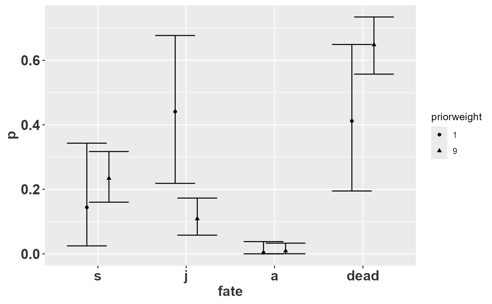
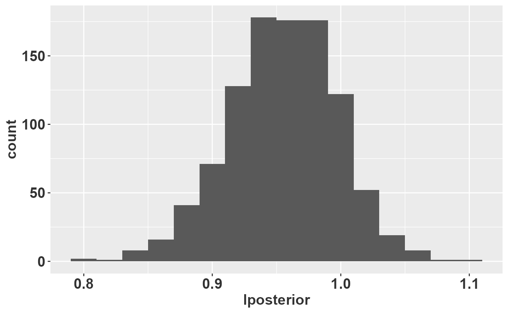
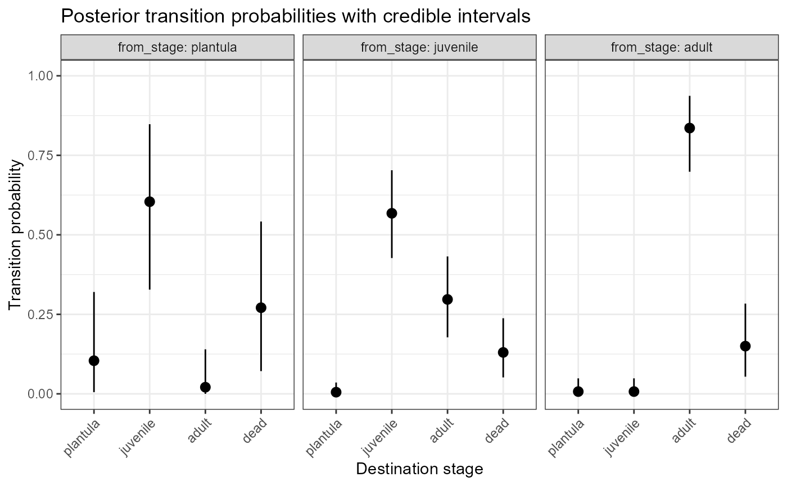

# 03 Working with a single population and transition

``` r

knitr::opts_chunk$set(echo = TRUE, tidy = TRUE)
library(dplyr)
library(purrr)
library(tibble)
library(ggplot2)
library(popbio) # for projection.matrix()
library(raretrans)
# Raymond's theme modifications
rlt_theme <- theme(axis.title.y = element_text(colour="grey20",size=15,face="bold"),
        axis.text.x = element_text(colour="grey20",size=15, face="bold"),
        axis.text.y = element_text(colour="grey20",size=15,face="bold"),  
        axis.title.x = element_text(colour="grey20",size=15,face="bold"))
```

The goal of this vignette is to demonstrate the use of package
`raretrans` on a single population and transition period.

## Part I: Obtaining the projection matrix

`raretrans` assumes the projection matrix is a list of two matrices, a
transition matrix and a fertility matrix. This is the output format of
[`popbio::projection.matrix`](https://rdrr.io/pkg/popbio/man/projection.matrix.html).
If we have individual transitions in a dataframe we can use
[`popbio::projection.matrix`](https://rdrr.io/pkg/popbio/man/projection.matrix.html)
to obtain the required data. We demonstrate with the transition and
fertility data for the epiphytic orchid *Lepanthes elto* **POPNUM 250**
in **period 5**.

### Step 1: Load and munge the single population data for *L. elto*

``` r

data("L_elto")  # load the dataset `L_elto` into memory (from package `raretrans`)
head(L_elto)
```

    ## # A tibble: 6 × 13
    ##   POPNUM  year seedlings adults fertility IND_NUM stage next_stage first_year
    ##    <dbl> <dbl>     <dbl>  <dbl>     <dbl>   <dbl> <chr> <chr>           <dbl>
    ## 1    209     1         1      6         0      67 j     j                   1
    ## 2    209     1         1      6         0      68 a     a                   1
    ## 3    209     1         1      6         0      69 a     a                   1
    ## 4    209     1         1      6         0      70 a     a                   1
    ## 5    209     1         1      6         0      71 j     a                   1
    ## 6    209     1         1      6         0      72 a     a                   1
    ## # ℹ 4 more variables: last_year <dbl>, recruited <lgl>, died <dbl>,
    ## #   lifespan <int>

Each row of this dataframe has columns for current stage, the next
stage, and average per individual fertility. Note that “p” stands from
“plantula” which means “seedlings” in Spanish. The first set of lines
below change the name of the life history stage from “p” to “s” after
selecting the population and time period.

``` r

onepop <- L_elto %>%
    # Filter out population # 250, period (year) 5
filter(POPNUM == 250, year == 5) %>%
    # redefine p for el plantón to s for seedling
mutate(stage = case_when(stage == "p" ~ "s", TRUE ~ stage), next_stage = case_when(next_stage ==
    "p" ~ "s", TRUE ~ next_stage))


# popbio::projection.matrix doesn't like tibbles set TF = TRUE to get the right
# format.
TF <- popbio::projection.matrix(as.data.frame(onepop), stage = stage, fate = next_stage,
    fertility = "fertility", sort = c("s", "j", "a"), TF = TRUE)
TF  # This is the stage-structured population model
```

    ## $T
    ##    
    ##              s          j          a
    ##   s 0.09090909 0.00000000 0.00000000
    ##   j 0.63636364 0.57446809 0.00000000
    ##   a 0.00000000 0.29787234 0.85294118
    ## 
    ## $F
    ##    
    ##             s         j         a
    ##   s 0.0000000 0.0000000 0.1176471
    ##   j 0.0000000 0.0000000 0.0000000
    ##   a 0.0000000 0.0000000 0.0000000

Our stages are now coded as **s** (seedling), **j** (juvenile), and
**a** (adult), and we now have two matrices: **T** (stage transition)
and **F** (fecundity). The observed asymptotic population growth rate is
$`\lambda =`$ 0.93. The rare transitions missing from our first
transition matrix, `TF$T`, are the transition from seedling (*s*) to
adult (*a*), and the transition from *j* to *s*. But we know that these
happen.

### Step 2: Obtain starting number of individuals per stage

Since our priors are based on counts (number of individuals, *N*) and
the prior equivalent sampling size is expressed as a multiple of the
number of individuals observed, we need to obtain the number of
individuals in each stage ($`N`$) at the first time period.

We use function
[`raretrans::get_state_vector()`](https://atiretoo.github.io/raretrans/reference/get_state_vector.md)
to obtain the starting individual count, *N*.

``` r

N <- get_state_vector(onepop, stage = stage, sort = c("s", "j", "a"))
N  # A vector of # of starting individuals for each stage
```

    ## [1] 11 47 34

The list of matrices and vector of individual counts do not have to come
from a dataframe as we’ve done here. As long as they have the expected
format they can be created by hand. We use population 231 in period 2 as
an example, splitting the matrix into transition T and fecundity F
matrices. Below, “m” stands for “muerte” that is plants that are dead.

``` r

TF2
```

    ## $T
    ##     stage
    ## fate         p         j         a
    ##    p 0.5000000 0.0000000 0.0000000
    ##    j 0.0000000 0.8333333 0.0000000
    ##    a 0.0000000 0.0625000 0.8750000
    ## 
    ## $F
    ##      [,1] [,2]  [,3]
    ## [1,]    0    0 0.125
    ## [2,]    0    0 0.000
    ## [3,]    0    0 0.000

``` r

N2
```

    ##  p  j  a 
    ##  2  6 16

This matrix is missing the transition from seedling to juvenile, and
none of the 6 juveniles died leading to an overestimate of survival. The
observed asymptotic population growth rate is $`\lambda =`$ 0.88. The
matrix is not Ergodic (you can’t get to every other state from one or
more states), and reducible, meaning one or more columns and rows can be
discarded and have the same eigen properties.

## Part 2: Using priors to incorporate rare transitions

### Use uninformative priors

Tremblay et al (in prep) show that a dirichlet prior works on the
columns of the transition matrix (**T**), and a gamma prior works for
entries in the fecundity matrix **F**.

#### Transition matrix

So, let’s add a uniform dirichlet prior with weight = $`1`$ to the
transition matrix, $`T`$. Here, we have 4 fates (3 + death), so each
fate adds 0.25 to the matrix of *observed* fates (not the transition
matrix!). When we specify a prior matrix for the transitions, there is
one more row than columns. This extra row represents death.

``` r

Tprior <- matrix(0.25, byrow = TRUE, ncol = 3, nrow = 4)
fill_transitions(TF, N, P = Tprior)  # returns transition matrix by default
```

    ##            [,1]        [,2]        [,3]
    ## [1,] 0.10416667 0.005208333 0.007142857
    ## [2,] 0.60416667 0.567708333 0.007142857
    ## [3,] 0.02083333 0.296875000 0.835714286

We can get the same result ‘by hand’ - we need the vector of
observations because the posterior is calculated from the observed
transitions, not the transition matrix.

``` r

Tobs <- sweep(TF$T, 2, N, "*")  # get the observed transitions
Tobs <- rbind(Tobs, N - colSums(Tobs))  # add the mortality row
Tobs <- Tobs + 0.25  # add the prior
sweep(Tobs, 2, colSums(Tobs), "/")[-4, ]  # divide by the column sum, and discard mortalityrow
```

    ##            s           j           a
    ## s 0.10416667 0.005208333 0.007142857
    ## j 0.60416667 0.567708333 0.007142857
    ## a 0.02083333 0.296875000 0.835714286

The uniform prior fills in the missing transitions, but also creates
problems because it provides transition values that are biologically
impossible. For example, it provides a transition for adult-\>seedling,
when this transition is only possible in the fecundity matrix $`F`$. For
this reason we do not recommend using uniform priors.

#### Fertility matrix

We must specify the parameters for the fertility prior as a matrix.
Entries representing stages that are non-reproducing or outcome stages
that don’t occur by reproduction should be `NA`.

``` r

alpha <- matrix(c(NA_real_, NA_real_, 1e-05, NA_real_, NA_real_, NA_real_, NA_real_,
    NA_real_, NA_real_), nrow = 3, ncol = 3, byrow = TRUE)
beta <- matrix(c(NA_real_, NA_real_, 1e-05, NA_real_, NA_real_, NA_real_, NA_real_,
    NA_real_, NA_real_), nrow = 3, ncol = 3, byrow = TRUE)
fill_fertility(TF, N, alpha = alpha, beta = beta)
```

    ##    
    ##             s         j         a
    ##   s 0.0000000 0.0000000 0.1176473
    ##   j 0.0000000 0.0000000 0.0000000
    ##   a 0.0000000 0.0000000 0.0000000

The change in the fertility is \< 0.0001 compared to the observed value.
Calculating by hand, prior alpha is the number of observed offspring,
and prior beta is the number of observed adults.

``` r

obs_offspring <- N[3] * TF$F[1, 3]
prior_alpha <- 1e-05
prior_beta <- 1e-05
posterior_alpha <- obs_offspring + prior_alpha
posterior_beta <- N[3] + prior_beta
posterior_alpha/posterior_beta  # expected value
```

    ## [1] 0.1176473

This demonstrates why the posterior point estimate of fecundity does not
change much; the non-informative values for $`\alpha`$ and $`\beta`$
barely change the observed values.

Now we can put them together.

``` r

unif <- list(T = fill_transitions(TF, N), F = fill_fertility(TF, N, alpha = alpha,
    beta = beta))
unif
```

    ## $T
    ##            [,1]        [,2]        [,3]
    ## [1,] 0.10416667 0.005208333 0.007142857
    ## [2,] 0.60416667 0.567708333 0.007142857
    ## [3,] 0.02083333 0.296875000 0.835714286
    ## 
    ## $F
    ##    
    ##             s         j         a
    ##   s 0.0000000 0.0000000 0.1176473
    ##   j 0.0000000 0.0000000 0.0000000
    ##   a 0.0000000 0.0000000 0.0000000

The asymptotic population growth rate is now $`\lambda =`$ 0.92. The
growth rate shrinks slightly because applying the uniform prior to the
transition probabilities causes the observed growth and survival
transitions to shrink slightly relative to the unobserved transitions.

#### Other options for argument `returnType`

By default
[`fill_transitions()`](https://atiretoo.github.io/raretrans/reference/fill_transitions.md)
returns the transition matrix $`T`$, and
[`fill_fertility()`](https://atiretoo.github.io/raretrans/reference/fill_fertility.md)
returns the fertility matrix $`F`$. There are three other values that
the argument `returnType` can take:

1.  `fill_transitions(... returnType = "TN")` can return an augmented
    matrix of fates, which is useful for simulation. The fourth row of
    this result (see below) is the mortality state.

``` r

fill_transitions(TF, N, returnType = "TN")
```

    ##      [,1]  [,2]  [,3]
    ## [1,] 1.25  0.25  0.25
    ## [2,] 7.25 27.25  0.25
    ## [3,] 0.25 14.25 29.25
    ## [4,] 3.25  6.25  5.25

2.  `fill_fertility(... returnType = "ab")` returns the alpha and beta
    vectors of the posterior.

``` r

fill_fertility(TF, N, alpha = alpha, beta = beta, returnType = "ab")
```

    ## $alpha
    ##    
    ##     s j       a
    ##   s     4.00001
    ##   j            
    ##   a            
    ## 
    ## $beta
    ##      [,1] [,2]     [,3]
    ## [1,]   NA   NA 34.00001
    ## [2,]   NA   NA       NA
    ## [3,]   NA   NA       NA

3.  Both functions can also return the full matrix, the sum of $`T`$ and
    $`F`$.

``` r

fill_transitions(TF, N, returnType = "A")
```

    ##    
    ##               s           j           a
    ##   s 0.104166667 0.005208333 0.124789916
    ##   j 0.604166667 0.567708333 0.007142857
    ##   a 0.020833333 0.296875000 0.835714286

### Incorporate informative priors

To fix the problem of creating impossible transitions, we specify a more
informative prior elicited from an expert on epiphytic orchids (RLT). It
still has to have the same shape, one more row than columns.

``` r

RLT_Tprior <- matrix(c(0.25, 0.025, 0, 0.05, 0.9, 0.025, 0.01, 0.025, 0.95, 0.69,
    0.05, 0.025), byrow = TRUE, nrow = 4, ncol = 3)
```

Note that the 1st row, 3rd column is 0.0, because this transition is
impossible. This prior is constructed so the columns sum to 1, which
creates the greatest flexibility for weighting the prior. By default the
weight is 1, interpreted as a prior sample size of 1.

``` r

fill_transitions(TF, N, P = RLT_Tprior)
```

    ##              [,1]         [,2]         [,3]
    ## [1,] 0.1041666667 0.0005208333 0.0000000000
    ## [2,] 0.5875000000 0.5812500000 0.0007142857
    ## [3,] 0.0008333333 0.2921875000 0.8557142857

We can specify the weight as a multiple of the sample size for each
stage.

``` r

fill_transitions(TF, N, P = RLT_Tprior, priorweight = 0.5)
```

    ##             [,1]        [,2]        [,3]
    ## [1,] 0.143939394 0.008333333 0.000000000
    ## [2,] 0.440909091 0.682978723 0.008333333
    ## [3,] 0.003333333 0.206914894 0.885294118

Here the prior is weighted half as much as the observed number of
transitions. In this case, with only 2 transitions the prior effective
sample size is still 1. If the number of observed transitions was
larger, a prior weight of 0.5N would be larger than 1, but still allow
the data to dominate.

## Part 3: Obtain Credible Intervals

### Obtain CI for indvidual matrix entries

The marginal posterior distribution of one element in a multinomial is a
beta distribution, and we use this to get credible intervals on our
transition rates. We can use the TN return type to get the parameters of
the desired multinomial.

``` r

TN <- fill_transitions(TF, N, P = RLT_Tprior, priorweight = 0.5, returnType = "TN")
a <- TN[, 1]  # change 1 to 2, 3 etc to get marginal distribution of other columns
b <- sum(TN[, 1]) - TN[, 1]  # change 1 to 2, 3 etc to get marginal distribution of other columns
p <- a/(a + b)
lcl <- qbeta(0.025, a, b)
ucl <- qbeta(0.975, a, b)
knitr::kable(sprintf("%.3f (%.3f, %.3f)", p, lcl, ucl))
```

| x                    |
|:---------------------|
| 0.144 (0.025, 0.343) |
| 0.441 (0.218, 0.677) |
| 0.003 (0.000, 0.038) |
| 0.412 (0.195, 0.649) |

Those are the point estimates (compare with first column above), lower
and upper $`95\%`$ symmetric credible intervals for transitions out of
the seedling stage. There is a high degree of uncertainty because of the
small sample size ($`2`$), and low weight on the prior ($`1`$), leading
to an effective sample size of 3. If we increase the effective sample
size to $`20`$ by specifying: `priorweight`$`= 9 (9*2 = 18 + 2 = 20)`$
the symmetric credible intervals shrink quite a bit:



The transition rate from seedling to juvenile shrinks when the prior
sample size is too large. In general the prior sample size should be
less than the observed sample size.

> **Interactive Exploration:** To visually test the effects of differing
> prior weights and explore posterior probability densities without
> writing code, you can launch the interactive Shiny app using
> [`raretrans::run_app()`](https://atiretoo.github.io/raretrans/reference/run_app.md).

### Credible intervals on $`\lambda`$

Obtaining credible intervals on the asymptotic growth rate, $`\lambda`$,
requires simulating matrices from the posterior distributions. This is
somewhat complicated to do correctly, and we have written a function
[`raretrans::sim_transitions()`](https://atiretoo.github.io/raretrans/reference/sim_transitions.md)
to generate a list of simulated matrices given the observed matrix and
prior specifications.

``` r

sim_transitions(TF, N, P = RLT_Tprior, alpha = alpha, beta = beta, priorweight = 0.5)
```

    ## [[1]]
    ##              [,1]       [,2]        [,3]
    ## [1,] 3.497222e-02 0.02485117 0.380322419
    ## [2,] 3.442645e-01 0.66156648 0.000610186
    ## [3,] 3.485163e-07 0.20367886 0.966110690

Now we simulate 1000 times, calculate the leading eigenvalue of each
matrix, and draw a histogram.

``` r

set.seed(8390278)  # make this part reproducible
alpha2 <- matrix(c(NA_real_, NA_real_, 0.025, NA_real_, NA_real_, NA_real_, NA_real_,
    NA_real_, NA_real_), nrow = 3, ncol = 3, byrow = TRUE)
beta2 <- matrix(c(NA_real_, NA_real_, 1, NA_real_, NA_real_, NA_real_, NA_real_,
    NA_real_, NA_real_), nrow = 3, ncol = 3, byrow = TRUE)
# generate 1000 matrices based on the prior transitions and fertilities plus
# the data
RLT_0.5 <- sim_transitions(TF, N, P = RLT_Tprior, alpha = alpha2, beta = beta2, priorweight = 0.5,
    samples = 1000)
# extract the lambdas for each matrix
RLT_0.5 <- tibble(lposterior = map_dbl(RLT_0.5, lambda))

ggplot(data = RLT_0.5, mapping = aes(x = lposterior)) + geom_histogram(binwidth = 0.02) +
    rlt_theme
```



We can calculate some summary statistics too. `pincrease` is the
probability that $`\lambda > 1`$.

``` r

RLT_0.5_summary <- summarize(RLT_0.5, medianL = median(lposterior), meanL = mean(lposterior),
    lcl = quantile(lposterior, probs = 0.025), ucl = quantile(lposterior, probs = 0.975),
    pincrease = sum(lposterior > 1)/n())
knitr::kable(RLT_0.5_summary, digits = 2)
```

| medianL | meanL |  lcl |  ucl | pincrease |
|--------:|------:|-----:|-----:|----------:|
|    0.96 |  0.95 | 0.87 | 1.03 |      0.13 |

``` r

cri <- transition_CrI(TF, N, stage_names = c("plantula", "juvenile", "adult"))
plot_transition_CrI(cri)
```


